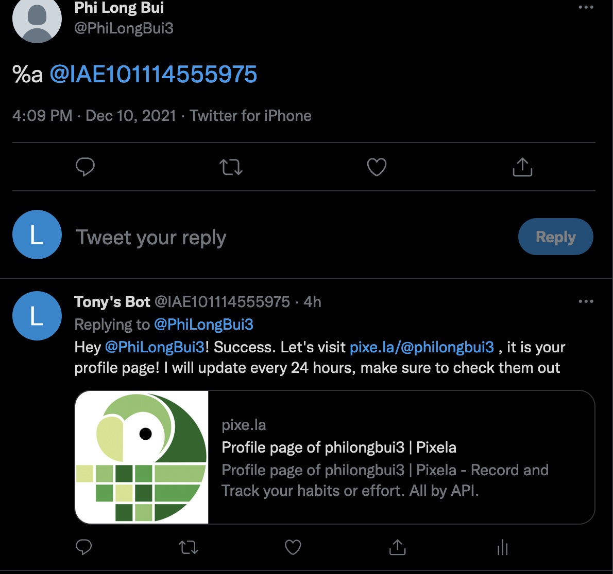
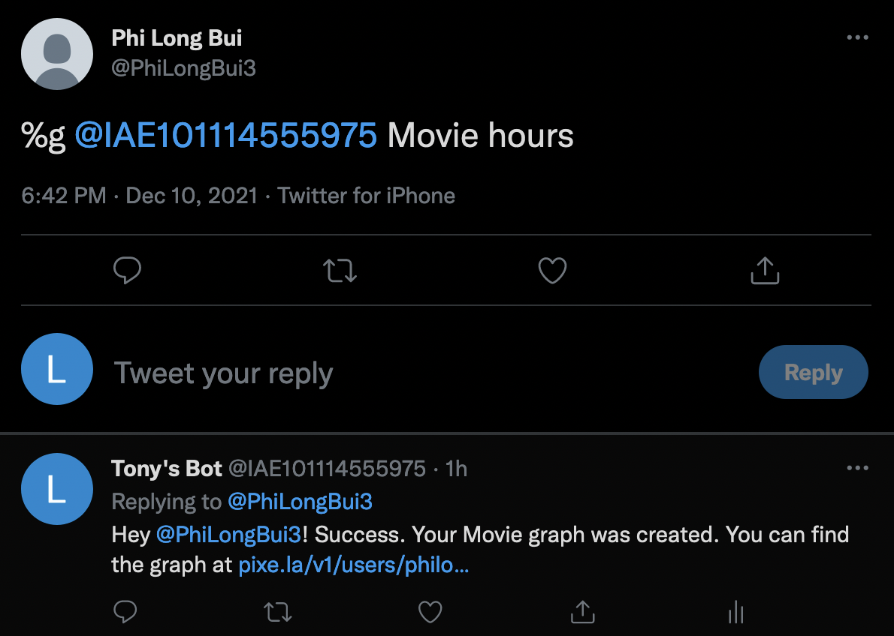
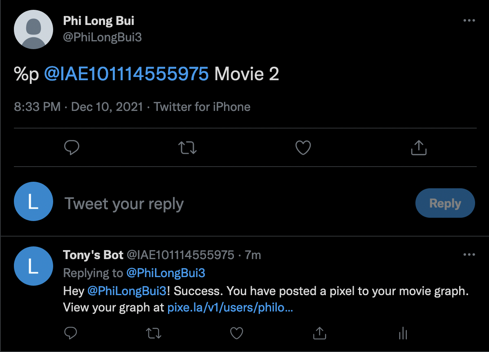
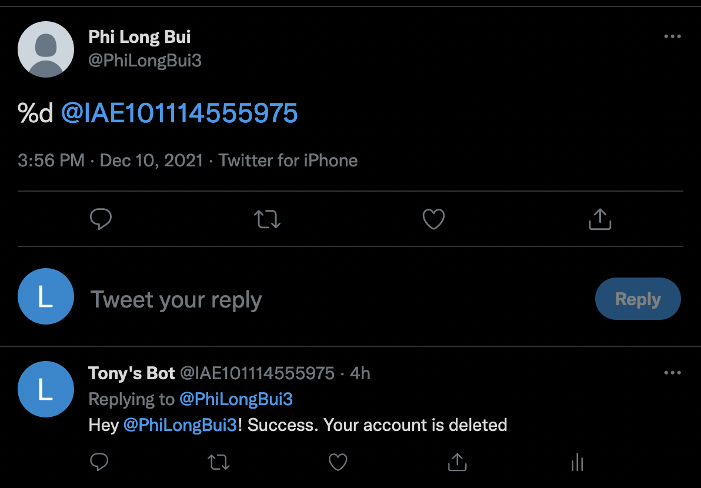

<div id="top"></div>

<!-- PROJECT SHIELDS -->
<!--
*** I'm using markdown "reference style" links for readability.
*** Reference links are enclosed in brackets [ ] instead of parentheses ( ).
*** See the bottom of this document for the declaration of the reference variables
*** for contributors-url, forks-url, etc. This is an optional, concise syntax you may use.
*** https://www.markdownguide.org/basic-syntax/#reference-style-links
-->
[![Contributors][contributors-shield]][contributors-url]
[![Forks][forks-shield]][forks-url]
[![Stargazers][stars-shield]][stars-url]
[![Issues][issues-shield]][issues-url]
[![MIT License][license-shield]][license-url]
[![LinkedIn][linkedin-shield]][linkedin-url]

<!-- PROJECT LOGO -->
<br />
<div align="center">
  <p>
    
 </p>

<h3 align="center">Procrastination Killer Bot</h3>

  <p align="center">
    The bot for a better habit
    <!--<br />
    <a href="https://github.com/github_username/repo_name"><strong>Explore the docs »</strong></a>-->
    <br />
    <br />
<!--     <a href="https://drive.google.com/uc?export=download&id=1rY_OOOybkd8zDA7SwHek3I6_Cy2AyheE">Download Demo</a>
    · -->
    <a href="https://github.com/tonybuii2003/TwitterBot/issues">Report Bug</a>
    <!--·
    <a href="https://github.com/github_username/repo_name/issues">Request Feature</a>
    -->
  </p>
</div>

<!-- TABLE OF CONTENTS -->
<details>
  <summary>Table of Contents</summary>
  <ol>
    <li>
      <a href="#about-the-project">About The Project</a>
      <ul>
        <li><a href="#built-with">Built With</a></li>
      </ul>
    </li>
    <li>
      <a href="#getting-started">Getting Started</a>
      <ul>
        <li><a href="#prerequisites">Prerequisites</a></li>
        <li><a href="#installation">Installation</a></li>
      </ul>
    </li>
    <li><a href="#usage">Usage</a></li>
    <li><a href="#roadmap">Roadmap</a></li>
    <!--<li><a href="#contributing">Contributing</a></li>-->
    <li><a href="#license">License</a></li>
    <li><a href="#contact">Contact</a></li>
    <li><a href="#acknowledgments">Acknowledgments</a></li>
  </ol>
</details>


<!-- ABOUT THE PROJECT -->
## About The Project
This is the final project for my IAE 101 course I took at Stony Brook University in Fall 2021. It is an open source creative project base on a Twitter bot.
The idea start from my personal issue with tracking habit, so I came up with a habit tracking bot with a hope to help me and other become more organized. 

[![Product Name Screen Shot][product-screenshot]](img/screenshot.png)

<p align="right">(<a href="#top">back to top</a>)</p>

### Built With

<!--* [Next.js](https://nextjs.org/) -->
* [Tweepy](https://www.tweepy.org/)
* [Python](https://www.python.org/)
* [PeasyCam](https://mrfeinberg.com/peasycam/)

<p align="right">(<a href="#top">back to top</a>)</p>


<!-- GETTING STARTED -->
## Getting Started
### Prerequisites

In order to use the bot, you need to have a twitter account, create one [here](https://twitter.com)

### Installation
To create an habit tracking account, simple tag my bot () with "%a" before it. <br /> 

<!--
1. Get a free API Key at [https://example.com](https://example.com)
2. Clone the repo
   ```sh
   git clone https://github.com/github_username/repo_name.git
   ```
3. Install NPM packages
   ```sh
   npm install
   ```
4. Enter your API in `config.js`
   ```js
   const API_KEY = 'ENTER YOUR API';
   ```

<p align="right">(<a href="#top">back to top</a>)</p>
-->


<!-- USAGE EXAMPLES -->
## Usage





<p align="right">(<a href="#top">back to top</a>)</p>


<!-- ROADMAP -->
## Roadmap

- [x] User can create an account.
- [x] User can delete the account
- [x] User can create a graph to keep track of their process
    - [x] Update a pixel to the graph
    - [x] Tweet the graph 
    - [ ] Tweet a pixel

See the [open issues](https://github.com/tonybuii2003/Twitter/issues) for a full list of proposed features (and known issues).

<p align="right">(<a href="#top">back to top</a>)</p>


<!-- LICENSE -->
## License

Distributed under the MIT License. See `LICENSE.txt` for more information.

<p align="right">(<a href="#top">back to top</a>)</p>

<!-- CONTACT -->
## Contact

Phi Long Bui - [Linkedin](https://www.linkedin.com/in/tonybui2003) - longphibui1993@gmail.com

<p align="right">(<a href="#top">back to top</a>)</p>


<!-- ACKNOWLEDGMENTS -->
## Acknowledgments

* [Processing Tutorials](https://processing.org/tutorials)

<p align="right">(<a href="#top">back to top</a>)</p>


<!-- MARKDOWN LINKS & IMAGES -->
<!-- https://www.markdownguide.org/basic-syntax/#reference-style-links -->
[contributors-shield]: https://img.shields.io/github/contributors/tonybuii2003/TwitterBot.svg?style=for-the-badge
[contributors-url]: https://github.com/tonybuii2003/TwitterBot/graphs/contributors
[forks-shield]: https://img.shields.io/github/forks/tonybuii2003/TwitterBot.svg?style=for-the-badge
[forks-url]: https://github.com/tonybuii2003/TwitterBot/network/members
[stars-shield]: https://img.shields.io/github/stars/tonybuii2003/TwitterBot.svg?style=for-the-badge
[stars-url]: https://github.com/tonybuii2003/TwitterBot/stargazers
[issues-shield]: https://img.shields.io/github/issues/tonybuii2003/TwitterBot.svg?style=for-the-badge
[issues-url]: https://github.com/tonybuii2003/ProjectZero/issues
[license-shield]: https://img.shields.io/github/license/tonybuii2003/TwitterBot.svg?style=for-the-badge
[license-url]: https://github.com/tonybuii2003/TwitterBot/blob/main/LICENSE
[linkedin-shield]: https://img.shields.io/badge/-LinkedIn-blue.svg?style=for-the-badge&logo=linkedin&colorB=555
[linkedin-url]: https://www.linkedin.com/in/tonybui2003
[product-screenshot]: img/screenshot1.png
